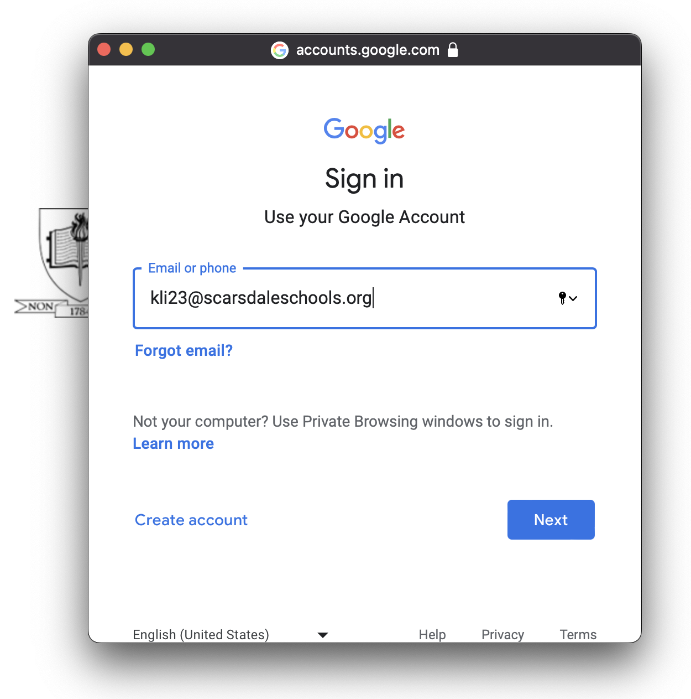
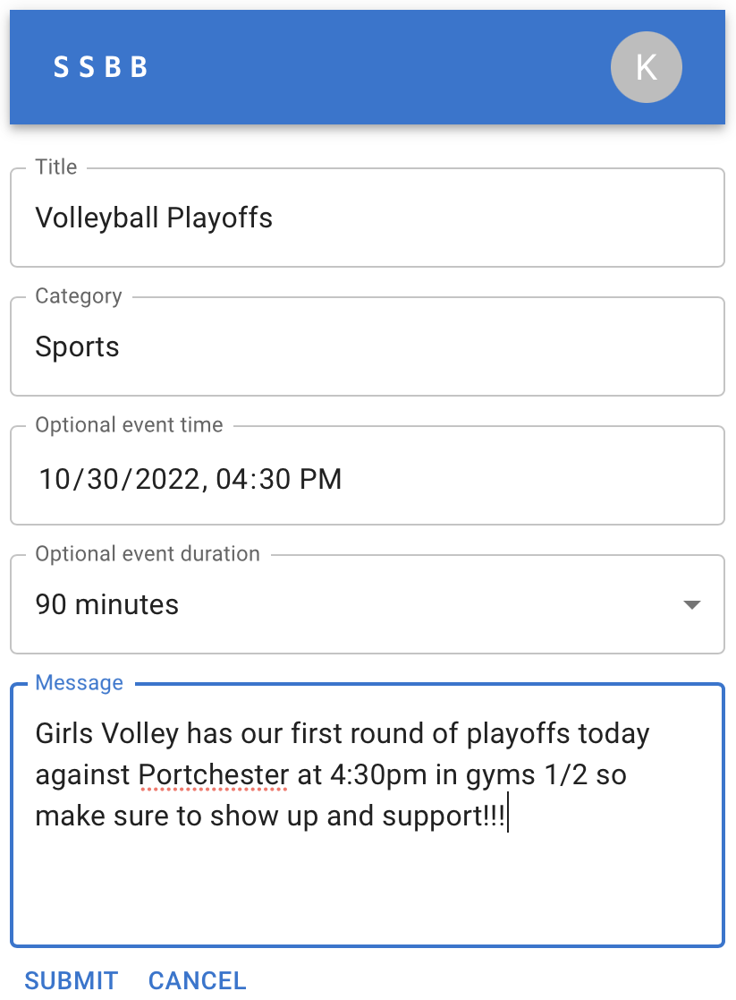
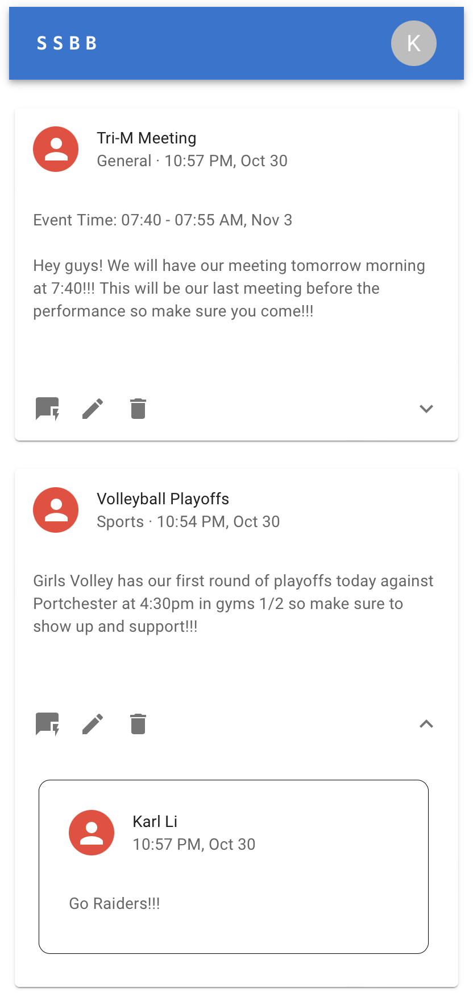

# Scarsdale Schools Bulletin Board

Scarsdale Schools Bulletin Board (SSBB) is a virtual bulletin board that allows student organizations to communicate with the student body. Clubs post announcements on the website for upcoming events with general users able to like, dislike, and comment for each post. The application consists of SQLite (or other relational database MySQL or H2) on the backend, REACT for the frontend, and utilizes Google Identity for security purposes to ensure only Scarsdale students are able to access SSBB. 

